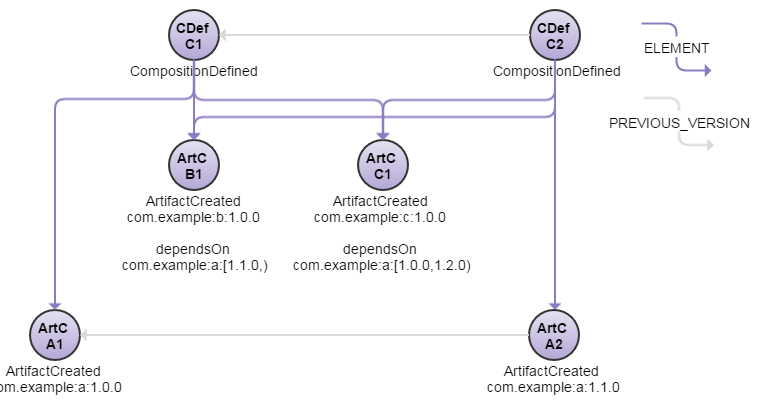

# Compositions and validity checking
A central concept in Eiffel is that of _compositions_. A composition represents a set of source, artifact and documentation items defined by [EiffelCompositionDefinedEvent](../eiffel-vocabulary/EiffelCompositionDefinedEvent.md) for some purpose, e.g. forming an execution environment, defining the contents of a delivery or instructing a build. Compositions may be very simple, consisting of a single item, or very large, containing any number of items in nested composition structures.

## Composition Validity
Using the __data.buildDependencies__ and __data.runtimeDependencies__ members of [EiffelArtifactCreatedEvent](../eiffel-vocabulary/EiffelArtifactCreatedEvent.md) the validity of any given composition can be checked.

### Checking  Dependencies
In this straight forward example, the integration of a system requires the presence of an interface and a third party library. Consider the following composition:

Here composition C2 is legal, but C1 is not. The reason is that B1 requires version "[1.1.0,)" of com.example:a (that is, version 1.1.0 or later). In composition C1 there is no such artifact, but in composition C2 there is.

### Checking Backend Implementation Validity
In this example we imagine a microservice setup. The service interface I has no implementation itself - instead it requires one or more implementations to which it can forward requests. There are multiple versions of the interface included, affording clients backwards compatibility.

Composition C1 is not valid: it contains two instances of A, one of I1 and one of I2. A implements I from version 1.0.0 up to, but not including, 2.0.0. Hence, I2 is lacking implementation is this composition.

Composition C2, on the other hand, is valid. It also contains two instances of A, but also one instance of B, which implements I from version 1.0.0 up to 3.0.0. Consequently, in this composition I1 has three artifacts implementing it, while I2 has one.

### Additional Notes
_Isn't this a reinvention of the wheel?_ you may ask. After all, there are plenty of tools that excel in handling dependency graphs. This is true, and the Eiffel dependency definition syntax is heavily influenced not least by [Maven](http://maven.apache.org). Eiffel operates at a highly technology and context agnostic level of abstraction, however, covering e.g. projects with highly diversified technology stacks and/or projects near or crossing over into hardware. This has both limitations and benefits. An Eiffel composition check can never guarantee that a given composition will work; what it can tell you is whether it is obviously broken.

It should also be noted that Eiffel's dependency syntax is opinionated. An interface requiring supporting implementation does not dictate that it requires any particular implementation (actually it can - simply use e.g. __data.runtimeDependency.dependsOn). Rather, it is up to that implementation to declare that it supports the interface. This is in order to encourage separation of concerns and decoupling.

Furthermore, Eiffel's dependency syntax makes no distinction between e.g. build time and runtime dependencies. This is for two reasons. First, it is not intended for low level dependency management: most programming languages have dedicated and specialized tools that will handle this type of dependency management. Instead, where Eiffel's comes into play is in tracking and validating large, sprawling systems of heterogeneous artifacts. Second, even if one attempts to develop specific syntax each type of dependency there will always be corner use cases which are not covered: better then to err on the side of abstraction, rather than implicitly ruling out use cases by being overly specific. That being said, it is also generally the case that an artifact has a fair idea of its intended use - it is rare that one and the same artifact is both a deployable service and a source code library, with the need to declare a unique set of dependencies for each case. Hence, the EiffelArtifactCreatedEvent dependency declarations shall be read in context. 
